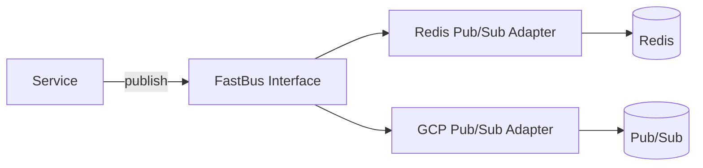

# Project Deep Dive — Messaging (Redis Pub/Sub → GCP Cloud Pub/Sub)

## 배경

서비스 규모가 커지면서 “메시지 전달”이 단순 구현을 넘어,

- 장애 전파 범위
- 재시도/순서/중복 처리
- 관측 가능성
- 테스트 가능성
  에 직접적인 영향을 주는 영역이 되었습니다.

특히 인프라 의존성이 강한 Redis Pub/Sub만으로는 **재현/검증/확장**이 어렵기 때문에,
GCP Cloud Pub/Sub 기반으로 전환할 수 있는 토대를 만들었습니다.

## 목표

- 메시징 구현체(Cloud Pub/Sub, Redis 등)를 **인터페이스로 추상화**하여 애플리케이션 로직과 분리
- CI에서 Pub/Sub를 재현할 수 있도록 **에뮬레이터 기반 테스트 환경** 제공
- 전환 과정에서 리스크를 낮추기 위해 “단계적 마이그레이션”이 가능한 구조 마련

## 주요 변경

### 1) 애플리케이션 측 전환 PR

- Redis를 Cloud Pub/Sub로 교체하는 방향의 변경

### 2) 공통 라이브러리(fastbus)로 추상화

- 전략 패턴으로 Cloud Pub/Sub/Redis Pub/Sub 구현체를 분리하고 `FastBus` 인터페이스로 통일

### 3) CI 재현성 확보

- GitHub Actions에서 Pub/Sub emulator를 띄워 메시징 테스트를 PR 단위로 검증

## 설계 포인트 (요약)

- **추상화의 경계**: “publish/subscribe의 최소 계약”만 인터페이스에 남기고, 인프라 세부 설정은 어댑터로 캡슐화
- **테스트 전략**: 단위 테스트는 인터페이스 계약 중심, 통합 테스트는 emulator로 재현
- **운영 전략**: 전환 단계에서 “기존 경로 유지 + 신규 경로 병행”이 가능하도록 구성(점진적 롤아웃)

## Mermaid 아키텍처(간단)

## 내가 배운 점 / 다음 개선

- “메시징”은 기능 개발보다 **운영 안정성(관측/재처리/멱등성)**이 중요
- 이후 단계에서는
  - DLQ(Dead Letter Queue) 전략
  - 멱등성 키 설계
  - 메시지 스키마 관리(버전)
    를 추가해 “운영 친화적 메시징”으로 확장할 수 있습니다.
