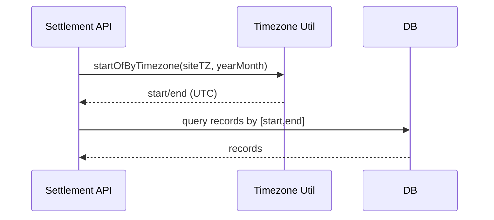

# Project Deep Dive — Settlement / Timezone Correctness

## 배경

정산/회계 도메인은 작은 시간 계산 실수도 금액 오류로 이어집니다.
특히 멀티사이트 운영에서

- **타임존**
- **월 경계(start/end)**
- **정산 기간 산정 기준**
  이 흔한 오류 지점이었습니다.

## 목표

- 실행 환경(서버 시간대, 런타임)과 무관하게 **일관된 기간 계산**
- 사이트별 시간 변환 정책을 코드로 명시
- 상태(state) 기반 로직을 분리하여 정산 생성의 안전성 강화

## 핵심 PRs

### 1) 타임존 기반 월 경계 유틸

- 특정 타임존 기준 월 시작/종료를 계산하는 유틸을 공통 모듈로 분리
- 테스트 코드를 통해 예시 케이스(UTC 변환 등)까지 검증

### 2) 사이트별 timezone 적용

- 시간 변환을 사이트에 맞게 변경하여 멀티사이트 운영에서 오류 가능성을 낮춤

### 3) 정산 PS 생성 시 state 검증

- PS 타입 아이템 생성 시 state 체크 로직을 추가
- 상태 패턴/유한상태머신 관점으로 책임을 분리하고 테스트 보강

### 4) 기술부채 정리(스키마 정합성)

- 대체된 컬럼 제거로 스키마/도메인 혼선을 줄임

## Mermaid — Timezone 산정(개념)

## 설계 포인트

- “정산 기간”은 **단일 유틸(함수)로 고정**하여 코드베이스 전반에서 동일하게 사용
- state 기반 흐름은 “조건문”이 아니라 **상태 객체/검증 클래스**로 분리하여 확장 시 안전

## 다음 개선 아이디어

- 기간 산정 결과를 메타데이터로 저장(감사/추적 용이)
- 월 경계/타임존 관련 케이스를 property-based 테스트로 확장
