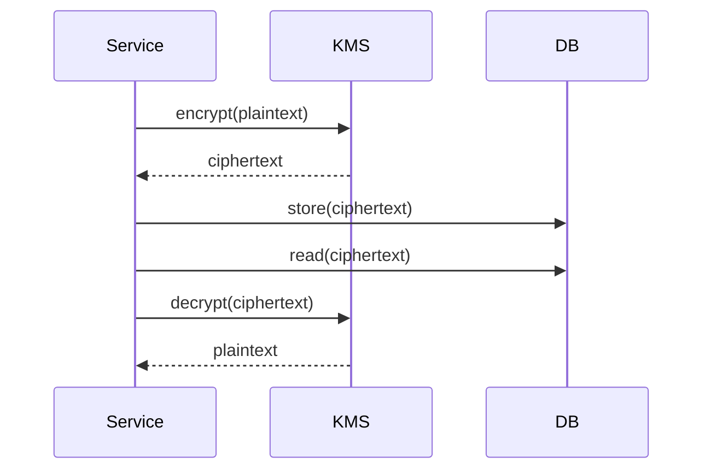

# Architecture — Data Encryption (Concept)

> 내부 구현은 보안상 일반화한 개념도입니다.

```mermaid
sequenceDiagram
  participant App as Service
  participant KMS as KMS
  participant DB as DB
  App->>KMS: encrypt(plaintext)
  KMS-->>App: ciphertext
  App->>DB: store(ciphertext)
  App->>DB: read(ciphertext)
  App->>KMS: decrypt(ciphertext)
  KMS-->>App: plaintext
```

- 키는 KMS에서 관리하고, 서비스는 최소 권한 원칙으로 접근합니다.
