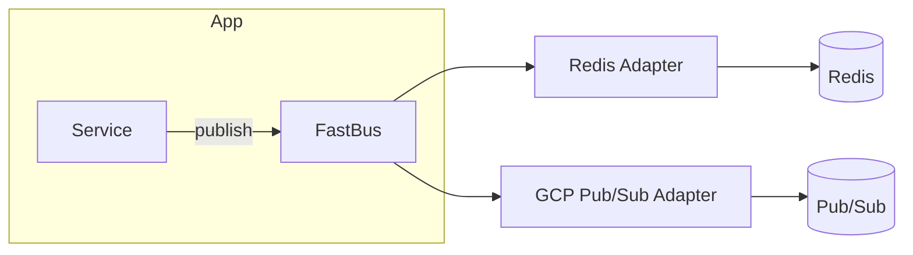

# Architecture — Messaging

```mermaid
flowchart LR
  subgraph App
    S[Service]
    B[FastBus]
  end

  S -->|publish| B
  B --> R[Redis Adapter]
  B --> P[GCP Pub/Sub Adapter]
  R --> RR[(Redis)]
  P --> PP[(Pub/Sub)]
```

- 앱 레이어는 `FastBus` 인터페이스에만 의존합니다.
- 인프라(Redis/PubSub) 세부는 어댑터로 캡슐화합니다.
