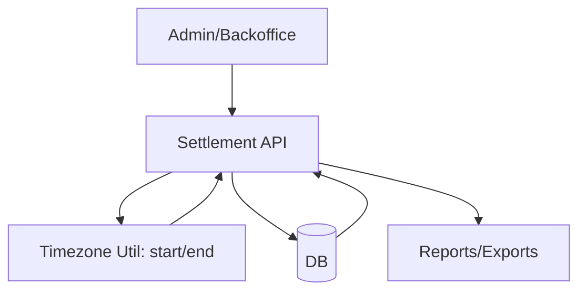

# Architecture — Settlement Data Flow (Concept)

```mermaid
flowchart TD
  A[Admin/Backoffice] --> B[Settlement API]
  B --> C[Timezone Util: start/end]
  B --> D[(DB)]
  C --> B
  D --> B
  B --> E[Reports/Exports]
```

- “정산 기간 산정”은 공통 유틸로 통일하여 정합성 문제를 줄입니다.
